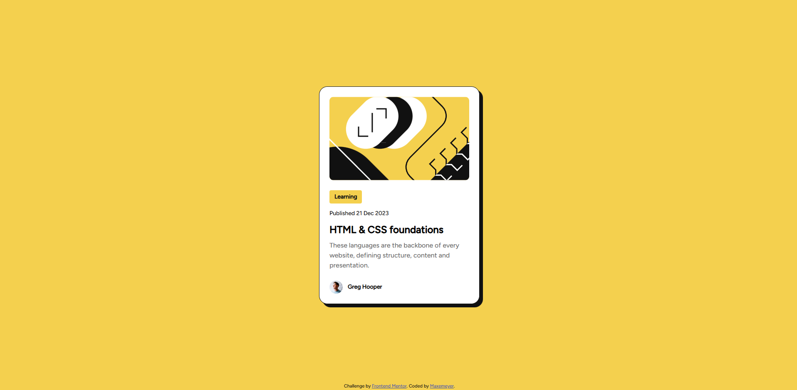

# Frontend Mentor - Blog preview card solution

This is a solution to the [Blog preview card challenge on Frontend Mentor](https://www.frontendmentor.io/challenges/blog-preview-card-ckPaj01IcS). Frontend Mentor challenges help you improve your coding skills by building realistic projects. 

## Table of contents

- [Overview](#overview)
  - [The challenge](#the-challenge)
  - [Screenshot](#screenshot)
  - [Links](#links)
- [My process](#my-process)
  - [Built with](#built-with)
  - [What I learned](#what-i-learned)
- [Author](#author)

## Overview

### The challenge

Users should be able to:

- See hover and focus states for all interactive elements on the page

### Screenshot



### Links

- Solution URL: [https://github.com/Maxemeyer/blogPreviewCard](https://github.com/Maxemeyer/blogPreviewCard)
- Live Site URL: [https://maxemeyer.github.io/blogPreviewCard/](https://maxemeyer.github.io/blogPreviewCard/)

## My process

### Built with

- Semantic HTML5 markup
- CSS custom properties
- CSS Grid
- Media Queries

### What I learned

- Deepened my knowledge of nested layouts and CSS Grid
- Improved the use of media queries for correct mobile display
- Understanding the specified requirements and their implementation
- Use of CSS custom properties

```css
:root {
  --clr-primary: #F4D04E;
  --clr-secondary: #111111;
  --clr-card-bg: #FFFFFF;
  --clr-description: #6B6B6B;

  --font-size-title: 24px;
  --font-size-description: 16px;
  --font-size-normal: 14px;

  --gap-card: 24px;
  --gap-content: 12px;
}
```

## Author

- GitHub - [Maxemeyer](https://github.com/Maxemeyer)
- Frontend Mentor - [@Maxemeyer](https://www.frontendmentor.io/profile/Maxemeyer)
